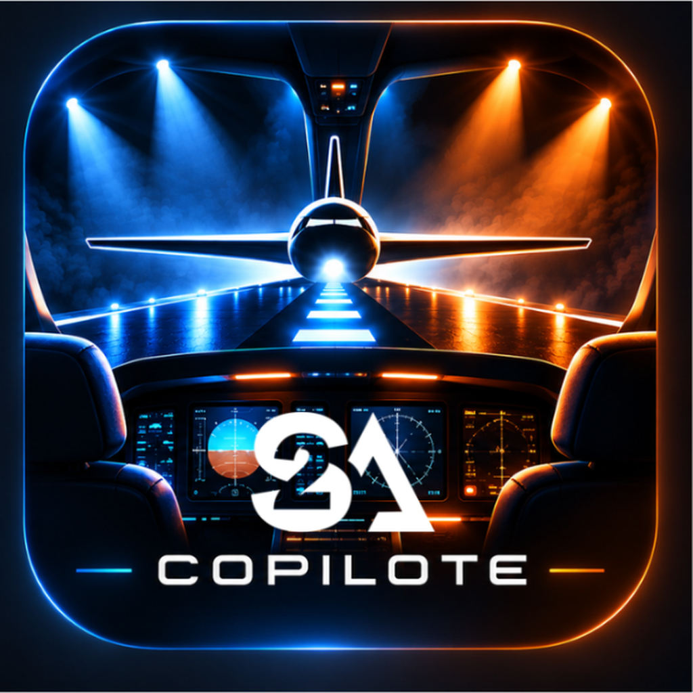

# S2A Pilot

<p align="center">
  
</p>

**S2A Pilot** est un outil de préparation et de conduite de spectacle multimédia développé par **S2A Production**.

Il permet à un artiste ou à un technicien de préparer simplement une conduite contenant des **Cues**, des fichiers audio, des vidéos, des visuels et des transitions, puis :

- de l'exploiter directement dans **S2A Pilot** ;
- ou de la transférer dans **QLab 5** grâce à **S2A Sopilote** pour macOS.

## Versions actuelles

- **S2A Pilot 1.4.1** — application web / PWA
- **S2A Copilote 1.2.2** — companion macOS pour QLab 5

## S2A Pilot

S2A Pilot est une application web installable conçue pour fonctionner notamment sur :

- iPad / iPadOS
- macOS
- Windows
- Android

L'application fonctionne localement et permet de préparer une conduite sans dépendre d'une application native spécifique.

### Fonctions principales

- Cues positionnées au dixième de seconde
- Mode **Édition**
- Mode **Show**
- Audio et vidéo
- Plusieurs médias indépendants dans une même conduite
- Points **IN / OUT**
- Waveform pour les fichiers audio
- Repérage visuel des vidéos
- Lecture en **Loop**
- Transition audio **CUT**
- Fondus réglables
- Arrêt / fondu de tous les médias
- Vidéo avec son ou vidéo muette
- Préchargement des médias avant le spectacle
- Sortie vidéo externe préparée au noir
- Déplacement dans la timeline pendant la lecture
- Resynchronisation des médias après déplacement
- Durée de conduite automatique ou manuelle
- Décompte avant la prochaine Cue avec alerte rouge sous 10 secondes
- Visuel associé à chaque Cue
- Mise en évidence de la Cue sélectionnée sur la timeline
- Sauvegarde locale
- Undo / Redo
- Génération d'une **fiche technique PDF**

## Format de projet

Les projets portables utilisent l'extension :

```text
.s2apilot.zip
```

Le package peut contenir :

```text
conduite.json
media/
visuals/
fiche-technique.pdf
companion/
LISEZ-MOI-Technicien.txt
```

Le but est que l'artiste puisse remettre **un seul package** au technicien.

Les anciens packages ShowCue restent pris en charge lorsque cela est possible.

## S2A Copilote

<p align="center">
  
</p>

**S2A Copilote** est l'application macOS chargée de traduire une conduite S2A Pilot en véritable workspace **QLab 5**.

Elle transforme les informations simples préparées par l'artiste en Cues techniques QLab.

### Traduction vers QLab

S2ACopilote peut notamment créer :

- Group Cues en mode Timeline
- Audio Cues
- Video Cues
- Memo Cues
- Stop Cues
- Fade Cues
- points IN / OUT
- Loops
- CUT audio
- fondus audio
- arrêts globaux audio / vidéo
- vidéos muettes
- déclenchements simultanés
- marqueur de fin de conduite

Une Cue S2A Pilot peut donc produire plusieurs Cues techniques dans QLab.

## Visualiseur

S2A Copilote dispose également d'un visualiseur destiné au suivi de conduite.

Il permet notamment d'afficher :

- la Cue active ;
- la prochaine Cue ;
- le visuel associé ;
- le décompte avant la prochaine Cue ;
- l'alerte rouge dans les dernières secondes.

## Workflow

```text
ARTISTE
  ↓
S2A Pilot
  ↓
Préparation des Cues
  ↓
Audio / Vidéo / IN / OUT / Loop / Fondus
  ↓
Enregistrer sous… 
  ↓
Projet .s2apilot.zip
  ↓
RÉGISSEUR
  ↓
S2A Copilote
  ↓
Import dans QLab 5
  ↓
Conduite QLab prête à être exploitée
```

## Structure du dépôt

```text
S2A-Pilot/
├─ PWA/                  S2A Pilot
├─ S2A-Copilote/        Application macOS / QLab
├─ README.md
∔— SESSION-2026-10-02.md
```

## Construction de S2A Copilote

Sur un Mac équipé des outils de déqÙ•±½ÁÁ•µ•¹Ğ�·¥�•ÍÍ…¥É•Ì€è()���‰…Í )���Lɵ
½Á¥±½Ñ”)�¡µ½�€­à�‰Õ¥±�¹Í (¸½‰Õ¥±�¹Í )��€()0�…ÁÁ±¥�…Ñ¥½¸�Ÿ¥»¥Ë¥”�•ÍĞ€è()���Ñ•áĞ)‰Õ¥±�½LÉ
½Á¥±½Ñ”¹…ÁÀ)��€()1”�‰Õ¥±��…�ÑÕ•°�ÕÑ¥±¥Í”�Õ¹”�Í¥�¹…ÑÕÉ”�±½�…±”€¼�…��¡½Œ�•Ğ�¹”�»¥�•Íͥє�Á…Ì�‘”�ÁÕ‰±¥�…Ñ¥½¸�ÍÕÈ�±”�5…Œ�ÁÀ�Mѽɔ¸((ŒŒ�A¡¥±½Í½Á¡¥”�‘Ô�Áɽ©•Ğ()LÉ�A¥±½Ğ�‘½¥Ğ�É•ÍÑ•È�ÍÕ™™¥Í…µµ•¹Ğ�Í¥µÁ±”�Á½Õȃ
ÑÉ”�ÕÑ¥±¥Ï¤�Á…È�Õ¸�…ÉÑ¥ÍÑ”�ÅÕ¤�¹”��½¹¹‡¹Ğ�Á…Ì�E1…ˆ¸()1„��½µÁ±•á¥Ó¤�Ñ•�¡¹¥ÅÕ”�•ÍĞ�Áɥ͔�•¸��¡…É�”�…Ô�µ½µ•¹Ğ�‘”�°�¥µÁ½ÉĞ�Á…È�LÉ�
½Á¥±½Ñ”¸()0�½‰©•�Ñ¥˜�•ÍĞ�‘½¹Œ€è((ø€¨©ÁË¥Á…É•È�Í¥µÁ±•µ•¹Ğ��ÑÓ¤�…ÉÑ¥ÍÑ”°�•áÁ±½¥Ñ•È�ÁɽÁÉ•µ•¹Ğ��ÑÓ¤�Ë¥�¥”¸¨¨((ŒŒ�¥Ù•±½ÁÁ•µ•¹Ğ()Aɽ©•Ğ�“¥Ù•±½Áä�Á½ÕÈ€¨©LÉ�Aɽ‘Õ�Ñ¥½¸¨¨¸()LÉ�A¥±½Ğ�•Ğ�LÉ�
½Á¥±½Ñ”�ͽ¹Ğ�…�ÑÕ•±±•µ•¹Ğ�•¸�“¥Ù•±½ÁÁ•µ•¹Ğ�…�Ñ¥˜¸(